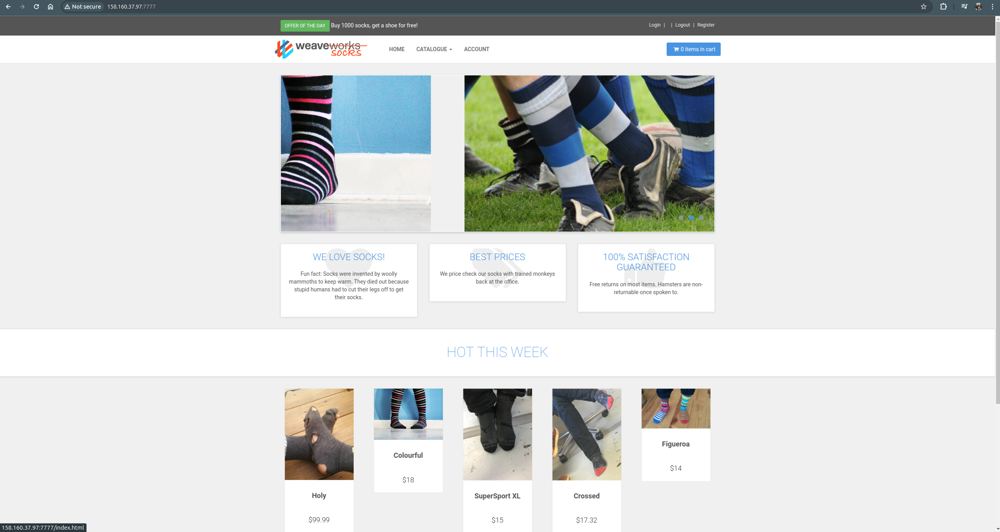
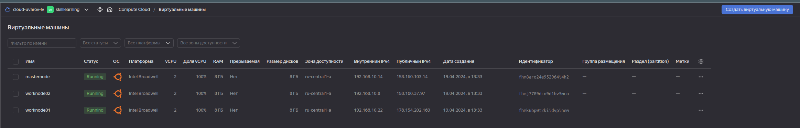

## Задание для самостоятельной работы (HW-03)

1. Установка и инициализация docker swarm

Открыл следующие порты на виртуальных машинах. 
Для master node:

```
firewall-cmd --add-port=2376/tcp --permanent;
firewall-cmd --add-port=2377/tcp --permanent;`
firewall-cmd --add-port=7946/tcp --permanent;
firewall-cmd --add-port=7946/udp --permanent;
firewall-cmd --add-port=4789/udp --permanent;
firewall-cmd --reload; 
```

`systemctl restart docker;`

Для worker node
```
firewall-cmd --add-port=2376/tcp --permanent;
firewall-cmd --add-port=7946/tcp --permanent;
firewall-cmd --add-port=7946/udp --permanent;
firewall-cmd --add-port=4789/udp --permanent;
firewall-cmd --reload;
```

`systemctl restart docker;`

Затем зашел на виртуальную машину, которая будет у нас master node. И выполнил следующую команду:

`docker swarm init`

Инициализация прошла успешно, в ответ вы получил следующую команду:

`docker swarm join --token SWMTKN-1-54k2k418tw2j0juwm3inq6crp4ow6xogswihcc5azg7oq5qo7e-a3rfeyfwo7d93heq0y5vhyzod 192.168.10.14:2377`

Выполнил на всех worker node, чтобы присоединить их в только что созданный кластер.
Выполнив следующую команду на manager ноде в консоли, увидим:

### docker node ls && docker service ls

![![docker node ls]](dockerls.png)


### UI




## Создал сервис визуализации кластера

```
docker service create \
	--name=viz \
	--publish=8880:8080 \
	--constraint=node.role==manager \
	--mount=type=bind,src=/var/run/docker.sock,dst=/var/run/docker.sock \
	dockersamples/visualizer
```


## Скриншот страницы в браузере (главной страницы проекта, работающего в Yandex.Cloud)

